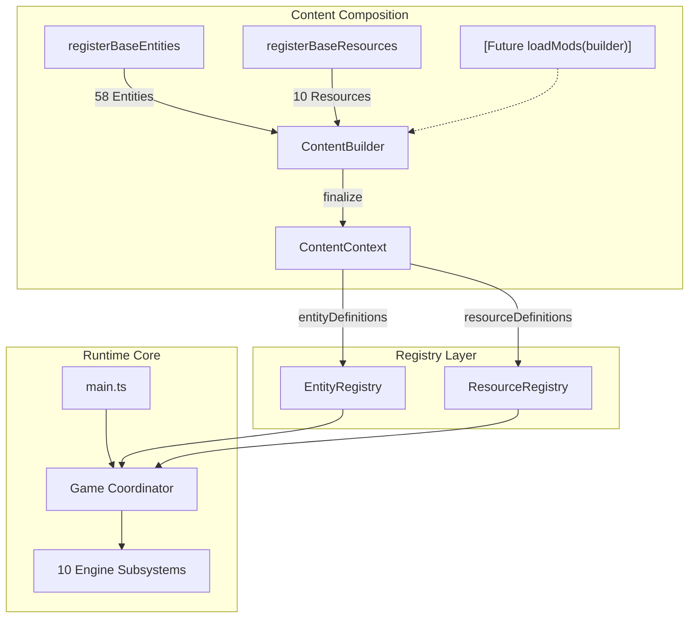

# Sixty Four: Cursed Edition

> A browser-native modernization and future modding platform for [Sixty Four](https://store.steampowered.com/app/2659900/Sixty_Four/).


---

## ⚡ The 15-Second Summary

- **What is this?** A fully decompiled, modernized, strictly typed TypeScript codebase for the automation game *Sixty Four*.
- **Does it work?** Yes. 100% gameplay, simulation, rendering, audio, and save compatibility with the desktop release.
- **Where does it run?** Natively in any modern web browser without Electron or Steam requirements.
- **What is the goal?** Clean architectural decomposition, robust hosted/offline build pipelines, and an internal content composition seam for future modding support.

```bash
# Clone and run locally in under 30 seconds
npm install
npm run dev
```

Open `http://127.0.0.1:6464` in your browser.

---

## 📖 Table of Contents

- [Why "Cursed Edition"?](#-why-cursed-edition)
- [Current Project Status](#-current-project-status)
- [Quick Start & Commands](#-quick-start--commands)
- [Build Targets](#-build-targets)
  - [Hosted Web Build](#hosted-web-build)
  - [Self-Contained Offline Build](#self-contained-offline-build)
  - [The `file://` Protocol & Local Servers](#the-file-protocol--local-servers)
- [Architecture Overview](#-architecture-overview)
  - [Content Composition & Modding Seam](#content-composition--modding-seam)
  - [Engine Subsystems](#engine-subsystems)
  - [Base Game Content](#base-game-content)
- [Roadmap](#-roadmap)
- [Modding & Modernization](#-modding--modernization)
- [Validation & Regression Testing](#-validation--regression-testing)
- [Legal & Upstream Notice](#-legal--upstream-notice)

---

## 🔮 Why "Cursed Edition"?

This project began with what seemed like a standard software engineering plan:

> *"Sixty Four is an Electron game distributed on Steam. Let's port it to the web."*

Then we inspected the shipping build.

The original game was not a compiled binary, a heavy native framework, or an obfuscated blob. It was already clean Canvas 2D, WebGL, Web Audio, HTML, JavaScript, and `localStorage` saves—with explicit fallback logic for when Electron and Steamworks are missing.

The initial "port" was literally:

```bash
cd game
python -m http.server 6464
```

And opening `http://localhost:6464`.

The game loaded. The cubes destabilized. The saves persisted. The audio played. The entire game ran natively in the browser on day one.

At that point, the name chose itself.

Rather than a simple wrapper, **Cursed Edition** evolved into a complete modernization effort: converting thousands of lines of monolithic legacy JavaScript into strict TypeScript, extracting 10 decoupled runtime subsystems, creating content-agnostic registries, and establishing an explicit content composition architecture for future mods.

---

## 📊 Current Project Status

### What Exists Today (Completed)

- [x] **Browser-Native Runtime**: Runs in all modern evergreen browsers with full Canvas2D / WebGL2 rendering.
- [x] **Strict TypeScript Migration**: 100% strict TypeScript (`strict: true`), zero explicit `any`, zero compiler suppressions.
- [x] **10 Decomposed Engine Subsystems**: `Save`, `Audio`, `Effects`, `Input`, `Rendering`, `Resources`, `Entities`, `Interaction`, `Autonomy`, `World Events`.
- [x] **Generic Content Registries**: Content-agnostic `EntityRegistry` (58 base entities) and `ResourceRegistry` (10 base resources).
- [x] **Unified Content Composition**: Two-phase `ContentBuilder` -> `ContentContext` pipeline with explicit base registration.
- [x] **Normalized Source Tree**: Clean `src/core/`, `src/engine/`, `src/content/`, `src/registry/`, and `src/resources/` directories with zero architectural cycles.
- [x] **Dual Build Targets**: Production-ready hosted web target (`dist/hosted/`) and self-contained offline distribution target (`dist/offline/`).
- [x] **Deterministic Semantic Regression Suite**: Comprehensive test fixtures verifying exact entity simulation, save compatibility, and 100% behavioral parity against the original game.

### What Does NOT Exist Yet (Future Work)

- [ ] Public Mod API (`ModContext` / public package schema).
- [ ] External `.64mod` discovery and runtime archive loader.
- [ ] IndexedDB save provider and multi-slot cloud sync.
- [ ] Modernized UI framework (TSX / React / Svelte migration).

---

## 🚀 Quick Start & Commands

All development and build operations use standard `npm` scripts:

| Command | Description |
|---|---|
| `npm run dev` | Starts local Vite dev server at `http://127.0.0.1:6464` |
| `npm run typecheck` | Validates strict TypeScript compilation (`tsc --noEmit`) |
| `npm run build:hosted` | Builds optimized static web assets to `dist/hosted/` |
| `npm run build:offline` | Builds self-contained offline bundle to `dist/offline/` |
| `npm run build` | Default build command (delegates to `build:hosted`) |
| `npm run preview:hosted` | Runs local HTTP preview server for `dist/hosted/` |
| `npm run preview:offline` | Runs local HTTP preview server for `dist/offline/` |
| `npm run validate:achievement-icons` | Validates all 34 achievement icons resolve to HTTP 200 OK |

---

## 📦 Build Targets

### Hosted Web Build

```bash
npm run build:hosted
```

- **Output Directory**: `dist/hosted/`
- **Characteristics**: Emits conventional optimized JavaScript chunks, CSS stylesheets, Web Worker chunks, and static media files.
- **Deployment**: Deployable to any static web host, CDN, GitHub Pages, or Netlify.
- **Configurable Base Path**: Supports subpath hosting via environment variable:
  ```bash
  VITE_BASE=/sixty-four/ npm run build:hosted
  ```

### Self-Contained Offline Build

```bash
npm run build:offline
```

- **Output Directory**: `dist/offline/`
- **Characteristics**: Inlines all application JavaScript and CSS directly into a single `index.html` file (2.27 MB), with local binary media assets (`images/`, `audio/`, `fonts/`, `video/`) copied as portable sibling folders.
- **Internet Requirement**: **Zero external network requests**. The game runs completely disconnected from the internet.

### The `file://` Protocol & Local Servers

Modern browser security policies enforce strict restrictions on `file:///` URLs:
1. **Web Audio Decoding**: The Fetch API blocks local `file:///` requests for binary audio files (`.mp3`) under CORS rules.
2. **Web Storage**: Browsers assign an opaque `null` origin to `file:///` files, preventing reliable `localStorage` persistence between sessions.

**Supported Offline Workflow**: Run any local static HTTP server (such as `npm run preview:offline`, Python `http.server`, or `npx serve dist/offline`). This provides standard origin security, audio decoding, and save persistence without needing an internet connection.

---

## 🏗️ Architecture Overview

The source tree is organized into clearly defined architectural layers:

```text
src/
├── core/                       # Top-level runtime coordinator (Game.ts)
├── engine/                     # 10 decoupled runtime subsystems
│   ├── audio/                  # AudioSystem & Web Audio decoding
│   ├── autonomy/               # AutonomySystem (chasm network simulation)
│   ├── effects/                # EffectSystem, particles, and animations
│   ├── entities/               # Entity base class & EntityManager
│   ├── events/                 # WorldEventSystem (surge, hollows, slowdown)
│   ├── input/                  # InputSystem (mouse, pointer, gamepad)
│   ├── interaction/            # InteractionSystem (placement, relocation)
│   ├── rendering/              # RenderSystem (Canvas 2D + WebGL2)
│   ├── resources/              # ResourceSystem (balances, analytics, rates)
│   └── save/                   # SaveSystem, SaveCodec, persistence
├── content/                    # Content composition & base definitions
│   ├── ContentContext.ts       # ContentBuilder & finalized ContentContext
│   ├── registerBaseContent.ts  # Master base content composition
│   └── base/                   # Concrete 58 entities & 10 resources
├── registry/                   # Generic content-agnostic registries
│   ├── EntityRegistry.ts       # O(1) definition & constructor lookup
│   └── ResourceRegistry.ts     # String ID & legacy index mapping
└── resources/                  # Consolidated static media assets
    ├── audio/sfx/              # Sound effects
    ├── fonts/                  # Montserrat fonts & CSS
    ├── images/                 # Sprites, UI icons, glory achievement icons
    └── video/                  # Credits video
```

### Content Composition & Modding Seam

Content registration is explicit, deterministic, and content-agnostic:



### Base Game Content

Base content is categorized according to verified structural metadata:
- **42 Machines** across 10 families: `pumps`, `channels`, `destabilizers`, `entropics`, `converters`, `storage`, `industrial`, `clickers`, `stabilizers`, `megas`.
- **3 Dynamic Entities**: `Cube`, `Eye`, `Surge`.
- **13 World Objects** across 4 families: `cosmic`, `monoliths`, `botanicals`, `anomalies` (including `Generaldecay`).
- **10 Legacy Resources**: Positional IDs `0..9` (`Charonite` through `Reality`).

---

## 🧩 Modding & Modernization

### Modding Architecture

1. **Current State**: The internal content composition layer (`ContentBuilder` -> `ContentContext`) is fully extensible. Synthetic tests verify that additional entities and resources can be registered alongside base content without altering existing mechanics.
2. **Future State**: An internal mod loader will hook into the composition seam before `builder.finalize()`, allowing external mods to supply entity classes, custom sprites, machine upgrades, and resource types via a structured API.

### Modernization Roadmap

```text
✓ Phase 1: Browser-native execution & baseline characterization
✓ Phase 2: Engine subsystem extraction (Save, Audio, Effects, Input, Rendering, Resources, Entities, Interaction, Autonomy, Events)
✓ Phase 3: Generic EntityRegistry & ResourceRegistry infrastructure
✓ Phase 4: Explicit content composition (ContentBuilder / ContentContext)
✓ Phase 5: Normalized source tree (src/) & consolidated asset tree (src/resources/)
✓ Phase 6: Dual build targets (hosted web & offline distribution)
→ Phase 7: Modernized UI layer & internal mod loader
→ Phase 8: Public Mod API & package manifest format
```

---

## 🧪 Validation & Regression Testing

To guarantee zero behavioral regression during extensive refactoring, all architectural milestones are validated against frozen semantic fixtures:

```bash
# Validate achievement icon assets
npm run validate:achievement-icons

# Full test suite (executed in CI / local test harness)
node tests/validate_achievement_icons.mjs
```

All 10 internal regression test suites verify:
- Exact 58-entity constructor and class reference identities.
- Exact 10-resource legacy index mapping and metadata preservation.
- Byte-for-byte identical 676-byte and 804-byte save serialization.
- Exact 18-stage simulation scheduler execution in `Game.updateLoop()`.

---

## ⚖️ Legal & Upstream Notice

**Sixty Four: Cursed Edition is an independent, unofficial community modernization project.**

- **Original Game**: Created by **Oleg Danilov** and published on Steam. Please support the developer by [purchasing the official game on Steam](https://store.steampowered.com/app/2659900/Sixty_Four/).
- **Copyright**: All original game design, artwork, music, sound effects, trademarks, and narrative text remain the intellectual property of Oleg Danilov and their respective rights holders.
- **Modernization Code**: Newly written architectural abstractions, build configurations, and TypeScript infrastructure are maintained as an open community research project.
- **Distribution Notice**: This repository does not claim commercial rights over Sixty Four. If you are distributing or hosting playable builds, ensure you own a legitimate copy of the game assets.

---

## 📄 License

Modernization code and architectural infrastructure are provided for educational and community development purposes. Original Sixty Four assets and intellectual property remain subject to their original copyright and commercial licensing. See [LICENSE](LICENSE) (or upstream distribution terms) for details.
