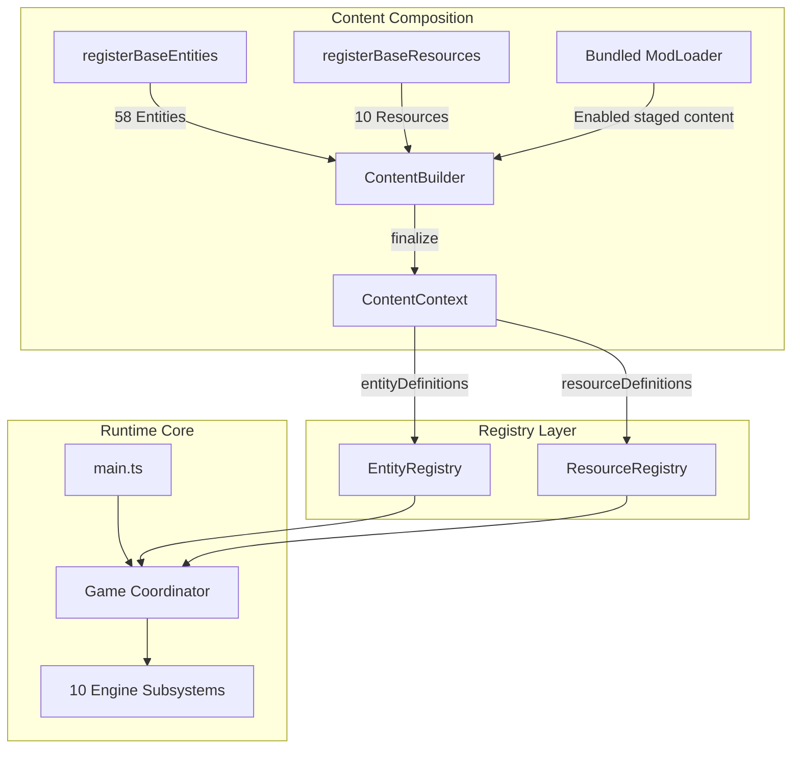

# Sixty Four: Cursed Edition

> A browser-native modernization with an experimental bundled Mod API v0 for [Sixty Four](https://store.steampowered.com/app/2659900/Sixty_Four/).


---

## The 15-Second Summary

- **What is this?** A fully decompiled, modernized, strictly typed TypeScript codebase for the automation game *Sixty Four*.
- **Does it work?** Yes. 100% gameplay, simulation, rendering, audio, and save compatibility with the desktop release.
- **Where does it run?** Natively in any modern web browser without Electron or Steam requirements.
- **What is the goal?** Preserve the game while providing clean architecture, hosted/offline builds, and a narrow experimental bundled-mod API.

```bash
# Clone and run locally in under 30 seconds
npm install
npm run dev
```

Open `http://127.0.0.1:6464` in your browser.

---

## Table of Contents

- [Why "Cursed Edition"?](#-why-cursed-edition)
- [Current Project Status](#-current-project-status)
- [Quick Start & Commands](#-quick-start--commands)
- [Build Targets](#-build-targets)
  - [Hosted Web Build](#hosted-web-build)
  - [Self-Contained Offline Build](#self-contained-offline-build)
  - [The `file://` Protocol & Local Servers](#the-file-protocol--local-servers)
- [Architecture Overview](#-architecture-overview)
  - [Content Composition & Modding Seam](#content-composition--modding-seam)
  - [Engine Subsystems](#engine-subsystems)
  - [Base Game Content](#base-game-content)
- [Modding & Modernization](#-modding--modernization)
- [Validation & Regression Testing](#-validation--regression-testing)
- [Legal & Upstream Notice](#-legal--upstream-notice)

---

## Why "Cursed Edition"?

This project began with what seemed like a standard software engineering plan:

> *"Sixty Four is an Electron game distributed on Steam. Let's port it to the web."*

Then we inspected the shipping build.

The original game was not a compiled binary, a heavy native framework, or an obfuscated blob. It was already clean Canvas 2D, WebGL, Web Audio, HTML, JavaScript, and `localStorage` saves—with explicit fallback logic for when Electron and Steamworks are missing.

The initial "port" was literally:

```bash
cd game
python -m http.server 6464
```

And opening `http://localhost:6464`.

The game loaded. The cubes destabilized. The saves persisted. The audio played. The entire game ran natively in the browser on day one.

At that point, the name chose itself.

Rather than a simple wrapper, **Cursed Edition** evolved into a complete modernization effort: converting thousands of lines of monolithic legacy JavaScript into strict TypeScript, extracting 10 decoupled runtime subsystems, creating content-agnostic registries, and establishing an explicit content composition architecture for bundled mods.

---

## Current Project Status

### What Exists Today (Completed)

- [x] **Browser-Native Runtime**: Runs in all modern evergreen browsers with full Canvas2D / WebGL2 rendering.
- [x] **Strict TypeScript Migration**: 100% strict TypeScript (`strict: true`), zero explicit `any`, zero compiler suppressions.
- [x] **10 Decomposed Engine Subsystems**: `Save`, `Audio`, `Effects`, `Input`, `Rendering`, `Resources`, `Entities`, `Interaction`, `Autonomy`, `World Events`.
- [x] **Generic Content Registries**: Content-agnostic `EntityRegistry` (58 base entities) and `ResourceRegistry` (10 base resources).
- [x] **Unified Content Composition**: Two-phase `ContentBuilder` -> `ContentContext` pipeline with explicit base registration.
- [x] **Normalized Source Tree**: Runtime code organized under `src/scripts/core/`, `engine/`, `content/`, `registry/`, and `modding/`, with assets under `src/resources/`.
- [x] **Dual Build Targets**: Production-ready hosted web target (`dist/hosted/`) and self-contained offline distribution target (`dist/offline/`).
- [x] **Deterministic Semantic Regression Suite**: Comprehensive test fixtures verifying exact entity simulation, save compatibility, and 100% behavioral parity against the original game.
- [x] **Experimental Mod API v0**: Deterministic bundled discovery, attributed logging, staged content registration, safe behavioral entities, and named UI visibility.
- [x] **Mods Menu**: Persistent enable/disable configuration with explicit reload-required behavior.
- [x] **Bundled Examples**: `hello-world`, `behavior-demo`, and `hide-banner`, all disabled by default.

### What Does NOT Exist Yet (Future Work)

- [ ] Stable Mod API v1 and published package/import schema.
- [ ] External/drop-in mod discovery and installer.
- [ ] IndexedDB save provider and multi-slot cloud sync.
- [ ] Optional broader render, save-state, shop/Codex, and hot-unload capabilities.

---

## Quick Start & Commands

All development and build operations use standard `npm` scripts:

| Command | Description |
|---|---|
| `npm run dev` | Starts local Vite dev server at `http://127.0.0.1:6464` |
| `npm run typecheck` | Validates strict TypeScript compilation (`tsc --noEmit`) |
| `npm run build:hosted` | Builds optimized static web assets to `dist/hosted/` |
| `npm run build:offline` | Builds self-contained offline bundle to `dist/offline/` |
| `npm run build` | Default build command (delegates to `build:hosted`) |
| `npm run preview:hosted` | Runs local HTTP preview server for `dist/hosted/` |
| `npm run preview:offline` | Runs local HTTP preview server for `dist/offline/` |
| `npm run test:mod-loader` | Validates deterministic bundled discovery and lifecycle behavior |
| `npm run test:mod-context` | Validates the public context/content boundary |
| `npm run test:mod-entity` | Validates safe behavioral entities |
| `npm run test:mod-menu` | Validates mod management and reload behavior |
| `npm run test:base-mods` | Validates the visible bundled mod set |
| `npm run test:mod-ui` | Validates named UI visibility composition |
| `npm run test:fullscreen` | Validates browser and Electron fullscreen paths |
| `npm run test:startup-splash` | Validates shared home/console startup artwork |
| `npm run test:mod-template` | Copies and typechecks the starter template |
| `npm run test:right-click` | Validates browser context-menu suppression |
| `npm run test:placement-preview` | Validates building placement previews |
| `npm run validate:achievement-icons` | Validates all 34 achievement icons resolve to HTTP 200 OK |

---

## Build Targets

### Hosted Web Build

```bash
npm run build:hosted
```

- **Output Directory**: `dist/hosted/`
- **Characteristics**: Emits conventional optimized JavaScript chunks, CSS stylesheets, Web Worker chunks, and static media files.
- **Deployment**: Deployable to any static web host, CDN, GitHub Pages, or Netlify.
- **Configurable Base Path**: Supports subpath hosting via environment variable:
  ```bash
  VITE_BASE=/sixty-four/ npm run build:hosted
  ```

### Self-Contained Offline Build

```bash
npm run build:offline
```

- **Output Directory**: `dist/offline/`
- **Characteristics**: Inlines all application JavaScript and CSS directly into a single `index.html` file (2.27 MB), with local binary media assets (`images/`, `audio/`, `fonts/`, `video/`) copied as portable sibling folders.
- **Internet Requirement**: **Zero external network requests**. The game runs completely disconnected from the internet.

### The `file://` Protocol & Local Servers

Modern browser security policies enforce strict restrictions on `file:///` URLs:
1. **Web Audio Decoding**: The Fetch API blocks local `file:///` requests for binary audio files (`.mp3`) under CORS rules.
2. **Web Storage**: Browsers assign an opaque `null` origin to `file:///` files, preventing reliable `localStorage` persistence between sessions.

**Supported Offline Workflow**: Run any local static HTTP server (such as `npm run preview:offline`, Python `http.server`, or `npx serve dist/offline`). This provides standard origin security, audio decoding, and save persistence without needing an internet connection.

---

## Architecture Overview

The source tree is organized into clearly defined architectural layers:

```text
src/
├── mods/                       # Bundled source mods
├── resources/                  # Consolidated static media assets
└── scripts/
    ├── core/                   # Top-level Game coordinator
    ├── engine/                 # 10 decoupled runtime subsystems
    ├── content/                # ContentBuilder and base definitions
    ├── registry/               # Generic entity/resource registries
    ├── modding/                # Loader, management, UI state, API types
    │   └── api/index.ts        # Supported source-local public entry
    ├── ui/ModsPanel.ts         # Bundled mod management panel
    └── main.ts                 # Composition and startup
examples/
└── mod-template/               # Copyable bundled-mod starter
```

### Content Composition & Modding Seam

Content registration is explicit, deterministic, and content-agnostic:



### Base Game Content

Base content is categorized according to verified structural metadata:
- **42 Machines** across 10 families: `pumps`, `channels`, `destabilizers`, `entropics`, `converters`, `storage`, `industrial`, `clickers`, `stabilizers`, `megas`.
- **3 Dynamic Entities**: `Cube`, `Eye`, `Surge`.
- **13 World Objects** across 4 families: `cosmic`, `monoliths`, `botanicals`, `anomalies` (including `Generaldecay`).
- **10 Legacy Resources**: Positional IDs `0..9` (`Charonite` through `Reality`).

---

## Modding & Modernization

### Modding Architecture

The experimental Mod API v0 is implemented. Bundled TypeScript mods under `src/mods/` are discovered by Vite, activated deterministically before content finalization, and managed through the home-screen **Mods** panel.

Current safe capabilities include attributed logging, staged entity/resource registration, per-instance behavioral entities, and one named UI visibility target (`'steam-warning'`). The API exposes neither `Game` nor raw DOM. Source-tree mods require a rebuild; there is no drop-in external installer or stable package API yet.

- [Beginner bundled-mod guide](docs/modding.md)
- [Exact experimental API v0 reference](docs/modding-api-v0.md)

### Milestone Status

```text
✓ Phase 1: Browser-native execution & baseline characterization
✓ Phase 2: Engine subsystem extraction (Save, Audio, Effects, Input, Rendering, Resources, Entities, Interaction, Autonomy, Events)
✓ Phase 3: Generic EntityRegistry & ResourceRegistry infrastructure
✓ Phase 4: Explicit content composition (ContentBuilder / ContentContext)
✓ Phase 5: Normalized source tree (src/) & consolidated asset tree (src/resources/)
✓ Phase 6: Dual build targets (hosted web & offline distribution)
✓ Phase 7: Bundled loader, Mods menu, and experimental Mod API v0
```

The planned experimental Modding v0 milestone is complete. External loading, safe rendering, behavior deletion/save hooks, dynamic resource balances, Codex/shop integration, hot unload, a possible `builtin:vanilla` conversion, and remaining internal modernization are optional future work rather than release blockers.

---

## Validation & Regression Testing

To guarantee zero behavioral regression during extensive refactoring, all architectural milestones are validated against frozen semantic fixtures:

```bash
# Core modding and browser regressions
npm run test:mod-loader
npm run test:mod-context
npm run test:mod-entity
npm run test:mod-menu
npm run test:base-mods
npm run test:mod-ui
npm run test:fullscreen
npm run test:startup-splash
npm run test:mod-template
npm run test:right-click
npm run test:placement-preview
npm run validate:achievement-icons
```

The permanent regression scripts verify:
- Exact 58-entity constructor and class reference identities.
- Exact 10-resource legacy index mapping and metadata preservation.
- Byte-for-byte identical 676-byte and 804-byte save serialization.
- Exact 18-stage simulation scheduler execution in `Game.updateLoop()`.

---

## Legal & Upstream Notice

**Sixty Four: Cursed Edition is an independent, unofficial community modernization project.**

- **Original Game**: Created by **Oleg Danilov** and published on Steam. Please support the developer by [purchasing the official game on Steam](https://store.steampowered.com/app/2659900/Sixty_Four/).
- **Copyright**: All original game design, artwork, music, sound effects, trademarks, and narrative text remain the intellectual property of Oleg Danilov and their respective rights holders.
- **Modernization Code**: Newly written architectural abstractions, build configurations, and TypeScript infrastructure are maintained as an open community research project.
- **Distribution Notice**: This repository does not claim commercial rights over Sixty Four. If you are distributing or hosting playable builds, ensure you own a legitimate copy of the game assets.

---

## License

`package.json` currently declares ISC for the package metadata, but this repository contains no standalone license file and that declaration does not automatically cover upstream Sixty Four code or assets. Modernization code and infrastructure are provided for educational and community development; original material remains subject to its original copyright and commercial terms. Do not publish downloadable playable builds unless you have the necessary distribution rights.
