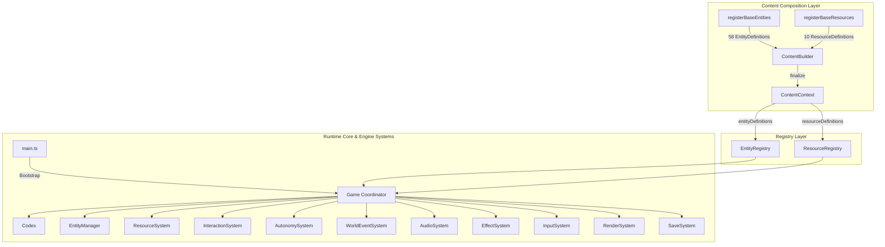

# Architecture Overview

This document describes the architectural layout, composition pipeline, and system boundaries in **Sixty Four: Cursed Edition**.

---

## 1. System Topology & Composition Pipeline

The project cleanly separates startup composition, generic registries, runtime engine subsystems, and base game content:



### Bundled Mod Loading Seam

The startup composition pipeline loads internal bundled mods before content finalization without requiring global monkey-patching. The current lifecycle context intentionally exposes only the mod ID and logger; content registration remains reserved for a future API version.

Bundled mods are trusted application code compiled by Vite. The internal loader validates manifests and isolates lifecycle errors, but it does not sandbox JavaScript or provide a security boundary. User-installed or downloaded code requires a separate trust and security design.

Bundled entry modules are static trusted ESM and must keep top-level evaluation side-effect free. Per-mod isolation begins when the loader validates the exported definition and continues through lifecycle setup.

```text
const builder = new ContentBuilder()

// 1. Explicit base content registration
registerBaseContent(builder)

// 2. Deterministic bundled mod discovery and activation
await loadBundledMods()

// 3. Finalization into immutable runtime context
const content = builder.finalize()

// 4. Game initialization with registered content
new Game(canvas, preload, content)
```

---

## 2. Directory Structure

```text
src/
├── core/                       # Top-level runtime coordinator
│   ├── Game.ts                 # Central Game coordinator & façade
│   └── types.ts                # Core runtime state types
│
├── engine/                     # Decomposed runtime engine subsystems
│   ├── audio/                  # AudioSystem & Web Audio decoding
│   ├── autonomy/               # AutonomySystem (automation network simulation)
│   ├── effects/                # EffectSystem, VFX, explosions, sparks, transfers
│   ├── entities/               # Entity base class, EntityManager, lifecycle
│   ├── events/                 # WorldEventSystem (hollow events, surge timer, slowdown)
│   ├── input/                  # InputSystem (mouse, pointer, gamepad)
│   ├── interaction/            # InteractionSystem (selection, placement, relocation)
│   ├── rendering/              # RenderSystem (Canvas2D + WebGL2 pipeline)
│   ├── resources/              # ResourceSystem (balances, analytics, pops, rates)
│   └── save/                   # SaveSystem, SaveCodec, LocalStorage storage
│
├── content/                    # Content infrastructure and base definitions
│   ├── ContentContext.ts       # ContentBuilder & finalized ContentContext
│   ├── registerBaseContent.ts  # Master base content composition
│   ├── types.ts                # Content registration contracts
│   └── base/                   # Concrete base content
│       ├── baseEntityMetadata.ts
│       ├── registerBaseEntities.ts
│       ├── entities/           # Dynamic entities (Cube, Eye, Surge)
│       ├── machines/           # 42 machines categorized into 10 families
│       │   ├── channels/
│       │   ├── clickers/
│       │   ├── converters/
│       │   ├── destabilizers/
│       │   ├── entropics/
│       │   ├── industrial/
│       │   ├── megas/
│       │   ├── pumps/
│       │   ├── stabilizers/
│       │   └── storage/
│       ├── world/              # 13 world entities (anomalies, botanicals, cosmic, monoliths)
│       └── resources/          # 10 base legacy resource definitions
│
├── registry/                   # Generic content-agnostic registries
│   ├── EntityRegistry.ts       # O(1) definition and constructor lookup
│   ├── ResourceRegistry.ts     # String ID & legacy numeric index mapping
│   ├── resource-types.ts       # Resource definition types
│   └── types.ts                # Entity definition types
│
├── resources/                  # Static runtime binary/media assets
│   ├── audio/sfx/              # 26 sound effects
│   ├── fonts/                  # Montserrat fonts & font stylesheet
│   ├── images/                 # Sprites, UI icons, glory achievement icons, shop art
│   └── video/                  # Credits background video
│
├── codex.ts                    # Compatibility progression & shop unlock metadata
├── words.ts                    # Multi-language localization dictionary
├── sprites.ts                  # Canvas sprite rendering helper
├── ui.ts                       # DOM UI (Shop, Splash, Messenger, Achiever, Explainer)
├── bezier.ts                   # Cubic bezier animation curve math
├── clock.ts                    # Web Worker tick interval (5ms)
└── main.ts                     # Application entry point & global legacy compatibility
```

---

## 3. Core Engine Subsystems

Each subsystem is isolated under `src/engine/` and communicates with the game coordinator through explicit host interfaces:

1. **`SaveSystem`**: Handles encoding/decoding via `SaveCodec`, local backup slots, and auto-saving.
2. **`AudioSystem`**: Decodes Web Audio buffers, calculates positional panning and distance loudness.
3. **`EffectSystem`**: Coordinates floating VFX, resource transfer arcs, sparks, and particle explosions.
4. **`InputSystem`**: Manages pointer capture, touch events, auto-clicker timers, and gamepad axes/buttons.
5. **`RenderSystem`**: Renders Canvas 2D scene, WebGL particle/grid backgrounds, and resource HUD homes.
6. **`ResourceSystem`**: Maintains mutable resource amounts, popup animations, analytics graph frames, and rate measurements.
7. **`EntityManager`**: Manages spatial coordinate lookup map (`stuffMap`), sorting, entity instantiation, and neighbor auto-initialization.
8. **`InteractionSystem`**: Handles cell selection, entity picking/placing, machine upgrading, and relocation logic.
9. **`AutonomySystem`**: Simulates the automated chasm-conductor-silo-aux-pump network.
10. **`WorldEventSystem`**: Manages surge spawning, slowdown events, and hollow stone site timers.

---

## 4. 18-Stage Game Scheduler

The simulation tick in `Game.updateLoop()` executes in an exact 18-stage deterministic order:

```text
1. Gamepad polling
2. Messenger queue update
3. Achiever milestone evaluation
4. Explainer tutorial hints
5. Slowdown event timer update
6. Unfilled machine fuel checks
7. Entity simulation updates (stuff iteration)
8. Resource halflife/crusade interactions
9. VFX animation updates
10. Hollow event timers
11. World visibility range calculation
12. Camera translation smoothing
13. Resource pop animation decay
14. Auto-clicker activation
15. Surge entity spawn checks
16. Analytics frame collection
17. Pinhole resource limit clamp
18. Clock worker next-tick trigger
```

---

## 5. Registries & Content Immutability

- **`EntityRegistry`**: Provides read-only `get(id)`, `has(id)`, and `getConstructor(id)` lookups. Initialized with 58 base entities.
- **`ResourceRegistry`**: Maps string IDs (`charonite`, `elmerine`, etc.) to legacy positional indexes (`0..9`). Validates syntax, prevents duplicate IDs and duplicate legacy indexes, and shallow-freezes definitions.
- **`ContentContext`**: Produced by `ContentBuilder.finalize()`. Both definition arrays and individual definitions are `Object.freeze`d to prevent accidental runtime mutation.
