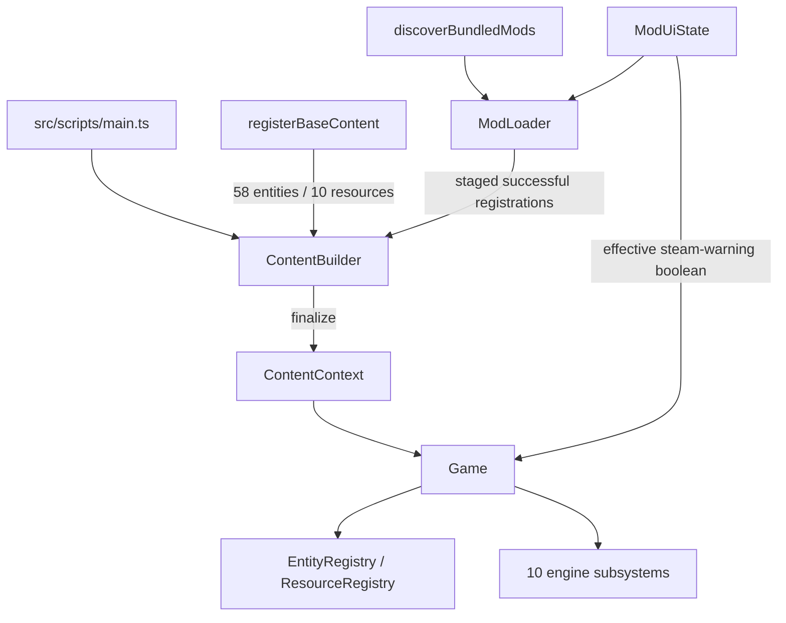

# Architecture Overview

This document describes the final Sixty Four: Cursed Edition architecture and the experimental Modding v0 boundary.

## Composition Pipeline



Startup registers base content, discovers source-tree mods, activates enabled mods in deterministic `ModId` order, finalizes immutable content, and only then constructs `Game`.

Bundled modules are trusted eager ESM. Top-level evaluation must remain side-effect free. Setup errors are isolated per mod, but this API is not a JavaScript sandbox.

## Modding Boundary

`ModContext` exposes only immutable mod information, an attributed logger, staged content registration, and a narrow semantic UI visibility API. It exposes no `Game`, engine host, subsystem, registry, raw entity, rendering context, or DOM object.

Behavioral entities run through an internal adapter. Their context is narrower than setup context: `self`, logger, resource reads, and spatial snapshots only. Setup UI capabilities are not available per entity.

`ModUiState` in `src/scripts/modding/ModUi.ts` is DOM-neutral. Owner-attributed hide requests compose as a set, and failed setup requests are discarded. `Game` receives only the final startup boolean for the Steam warning, so generic modding infrastructure does not import `Game`, `Splash`, or DOM implementation classes.

## Startup Presentation

The home-screen logo is a 4-by-2 sprite sheet at `src/resources/images/logo/sheet.png`, yielding eight variants. `src/scripts/startupPresentation.ts` selects one row-major variant once in the guarded startup path. The same variant identity supplies both the Splash background position and its matching small console preview.

The console preview files are 1:1 crops under `src/resources/images/logo/console/`. They remain below Vite's hosted inline threshold, allowing DevTools CSS to use data images without embedding the full 529 KB sprite sheet in application JavaScript. The startup console splash is one call per document startup.

## Directory Structure

```text
src/
├── mods/                         # Bundled source mods and internal fixtures
├── resources/                    # Images, audio, fonts, and video
└── scripts/
    ├── content/                  # ContentBuilder and 58/10 base definitions
    ├── core/                     # Game coordinator and host contracts
    ├── engine/                   # Runtime subsystems
    │   ├── audio/
    │   ├── autonomy/
    │   ├── effects/
    │   ├── entities/
    │   ├── events/
    │   ├── input/
    │   ├── interaction/
    │   ├── rendering/
    │   ├── resources/
    │   └── save/
    ├── modding/                  # Loader, desired UI state, management, API types
    │   └── api/index.ts          # Supported source-local public mod entry
    ├── registry/                 # Generic entity/resource lookup
    ├── ui/ModsPanel.ts           # Bundled mod management UI
    ├── startupPresentation.ts    # Shared home/console variant identity
    ├── ui.ts                     # Legacy-compatible DOM UI
    └── main.ts                   # Composition and runtime bootstrap
examples/
└── mod-template/                 # Copyable bundled source-mod starter
```

## Runtime Subsystems

The game coordinator delegates to 10 focused systems:

1. `SaveSystem`
2. `AudioSystem`
3. `EffectSystem`
4. `InputSystem`
5. `RenderSystem`
6. `ResourceSystem`
7. `EntityManager`
8. `InteractionSystem`
9. `AutonomySystem`
10. `WorldEventSystem`

They communicate through explicit host interfaces. Generic registries are initialized from finalized content and preserve the base game's semantic IDs and legacy resource indexes.

## Scheduler

`Game.updateLoop()` preserves the characterized 18-stage simulation order: gamepad, messages, achievements, tutorial, slowdown, fuel checks, entity updates, resource interactions, effects, hollow events, visibility, camera, resource pops, auto-clickers, surge spawning, analytics, pinhole clamp, then clock-worker trigger.

## Immutability And Transactions

`ContentBuilder.finalize()` freezes definitions into `ContentContext`. Per-mod content and UI changes are staged and committed only after successful setup. Base registration order is preserved; successful mod registrations append in deterministic activation order.

Enable/disable changes persist through the Mods panel and require reload. Hot unload and rollback of a running game are intentionally outside v0.
